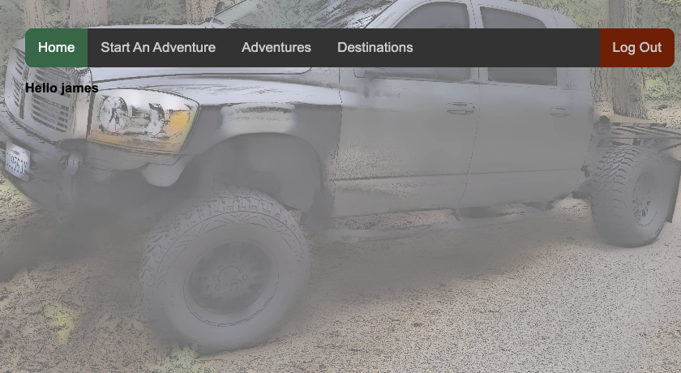
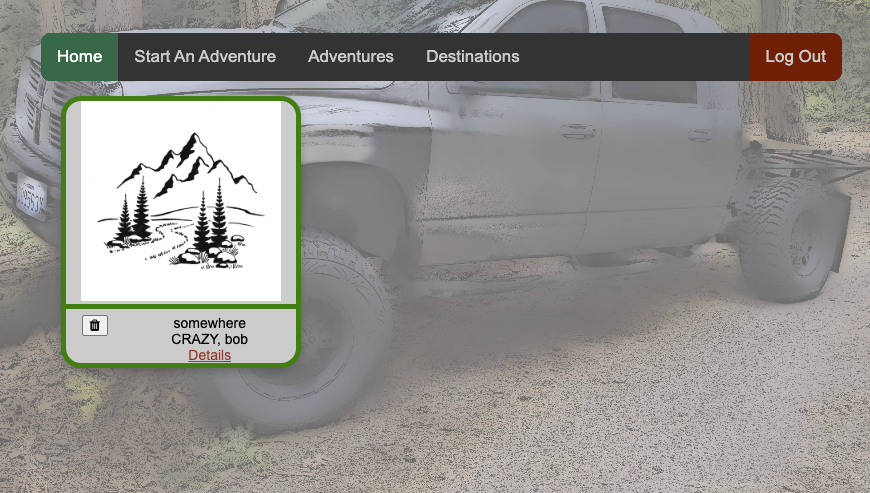
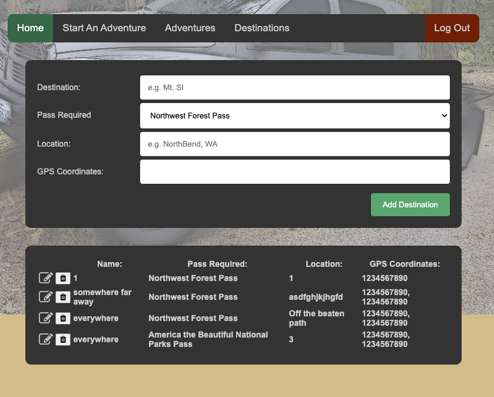
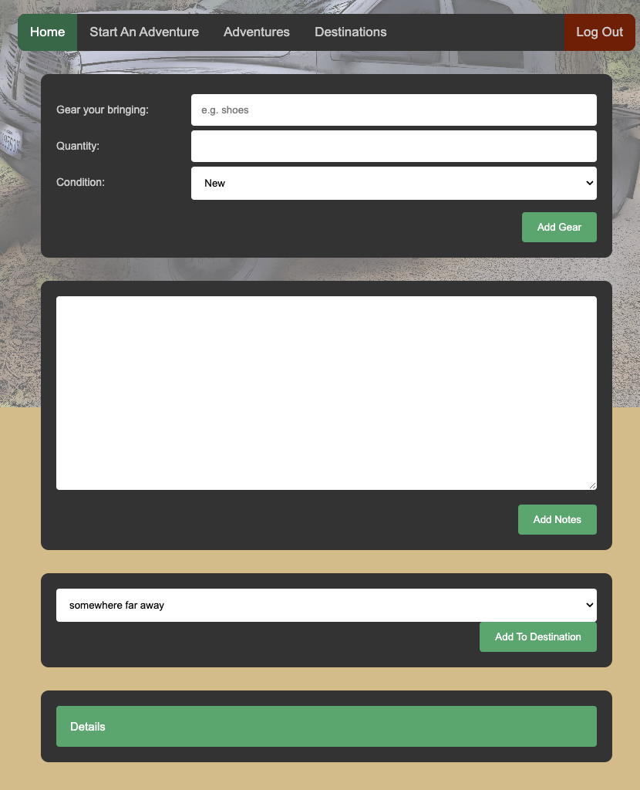

#Adventure Planner

The planner I built allows you to create a plan for your trip helping the user to stay organized by adding what gear they will bring, any notes and what destinations they will be seeing.

###Screenshots

###Technologies Used
HTML, CSS, Java Script, Google OAuth, MongooseDB, Node.js, Ejs.

###Getting Started
Trello: https://trello.com/b/nRyc98tl/project-2
Deployment: To be added soon!

###Next Steps
I have an ever growing list of future additions I would like to make. I have my full list on my Trello board. Some of my ideas that I am most excited for are adding modals for adding and update info, adding a map to locate trails and adding a social aspect to the site.